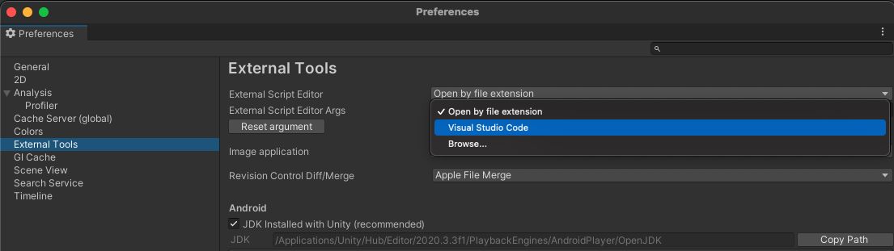

# Pladdra

## Downloading Unity

Unity can be downloaded [here](https://store.unity.com/download)

## Setting up VSCode

1. Install [.NET Core SDK](https://dotnet.microsoft.com/download)
2. [Windows only] Logout or restart Windows to allow changes to `%PATH%` to take effect.
3. [macOS only] Install the latest [mono](https://www.mono-project.com/download/stable/) release
4. Install the [C# extension](https://marketplace.visualstudio.com/items?itemName=ms-dotnettools.csharp) for VSCode

## Setup VS Code as Unity Script Editor

Open up **`Unity Preferences`** > **`External Tools`** then browse for the Visual Studio Code executable as External Script Editor

> The Visual Studio Code executable can be found at `/Applications/Visual Studio Code.app` on macOS and `%localappdata%\Programs\Microsoft VS Code\Code.exe` on Windows by default.

## Adding the project to Unity

After cloning the repository, you can add it to Unity by clicking the `Add` button in Unity Hub.

